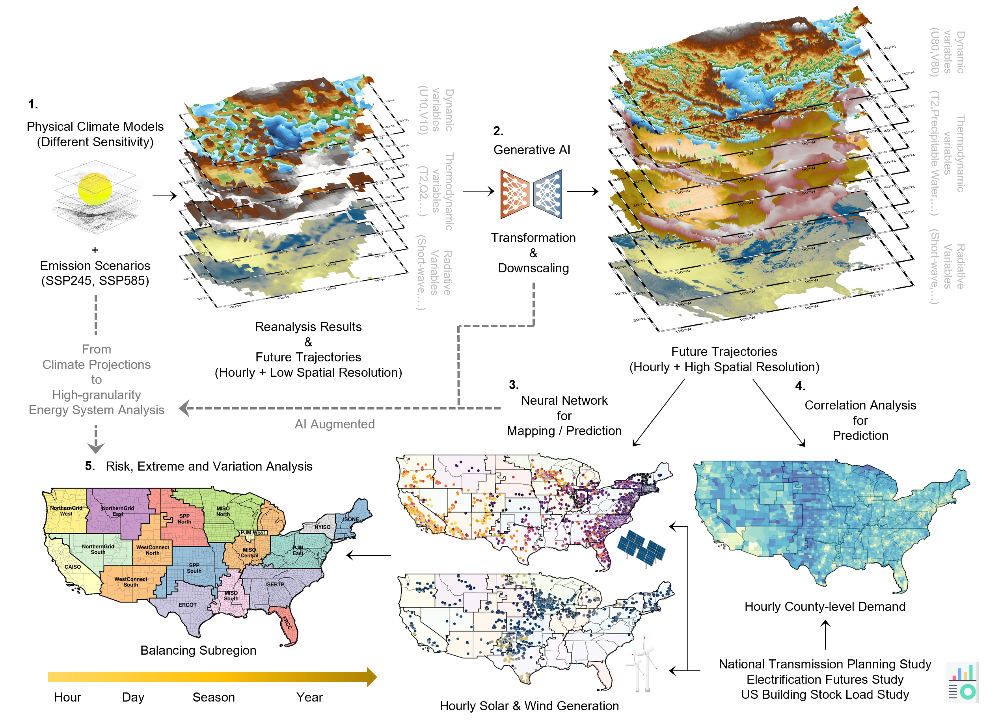

# Climate-Energy Extremes Analysis Codebase

This repository contains the official code used in the paper _Climate-Driven Extremes and Regional Divergence in Renewable-Powered Energy Systems_.

The analysis investigates how climate-driven shifts impact energy system extremes across multiple timescales using data-driven methods and deep learning models.

---

##  Overview

A conceptual illustration of the study framework and workflow is shown below:

The image summarizes the overall design of the data pipeline, modeling, and multi-timescale extreme energy system event evaluation.

---

##  Repository Contents

This codebase includes the following components:

- 📈 **Renewable generation and load analysis** (2018–2022 hourly data)
- 🧠 **Deep learning models** for weather super-resolution (`train_srgan`) and renewable generation predictions (`train_unet`)
- 🧰 **Common tools and data preprocessors**
- 📊 **Visualization templates and plotting utilities**
- 💧 **Hydrological impact studies in SI**

---

## 📁 Folder Structure

| Folder           | Description |
|------------------|-------------|
| `county/`        | County-level metadata (e.g., region mappings, FIPS codes) |
| `figs/`          | Figures used in the paper, including `figure1.png` for schematic |
| `future/`        | Code for future energy and climate scenario projections (2030–2050) |
| `hydro/`         | Hydropower-related analysis, including ecological and operational aspects |
| `load/`          | Load data processing: commercial, residential, industrial, and transport |
| `model/`         | Shared model architectures and loss functions (for SRGAN) |
| `plot_examples/` | Scripts to generate paper and supplement figures |
| `train_srgan/`   | Super-resolution GAN (SRGAN) training scripts and configs |
| `train_unet/`    | U-Net model training for per capactiry renewable predicton tasks |
| `utils/`         | Utility functions for loading, normalizing, and evaluating data |

---

## 📂 Data Requirement

This codebase depends on a **Google Drive dataset (~1 TB)**, which includes:

[Google Drive Link] (https://drive.google.com/drive/folders/1nR9cPL55tvpurUy_4ExEhLzU9bbjwgeF?usp=sharing)

- ✅ 5 full years of hourly data (2018–2022), i.e., 8760 hours/year
- ✅ Renewable generation, load, meteorology, and hydrology at high spatiotemporal resolution
- ✅ 2018 year round 8760 hour county level loads
- ✅ Future weather projections given by CMIP6 models
- ✅ AI model training checkpoints

### 🧾 Data Sources

- Described in detail in the **Supplementary Information (SI)** of the paper.
- Downloaded via tools such as:
  - [Herbie](https://github.com/blaylockbk/Herbie) for meteorological reanalysis
  - [AWS CLI](https://aws.amazon.com/cli/) for public archive access
  
Thanks for the providers of data sources and related download packages!

